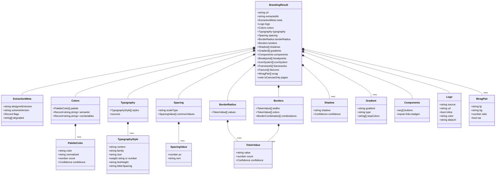
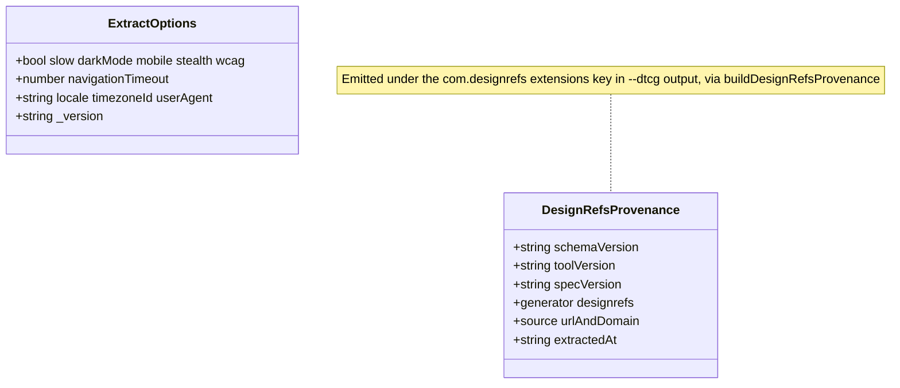

# designrefs type model

Visual map of the extraction output contract, generated from `lib/types.ts` and
`lib/version.ts`. `BrandingResult` is the root every consumer (CLI, MCP,
designrefs-next, drift) reads. Renders in VS Code (Mermaid preview) and GitHub.

## Version contract (`lib/version.ts`)

Separate from the data shape: three independent version axes plus the DTCG
`$extensions` provenance block.

